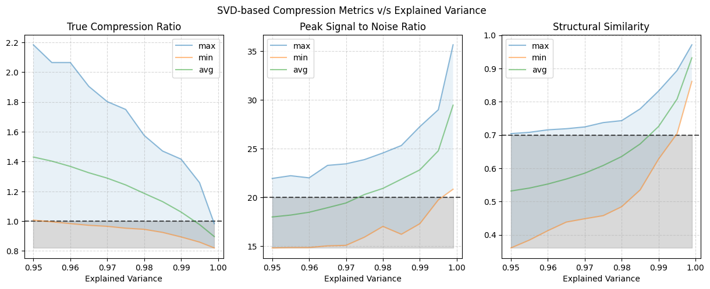
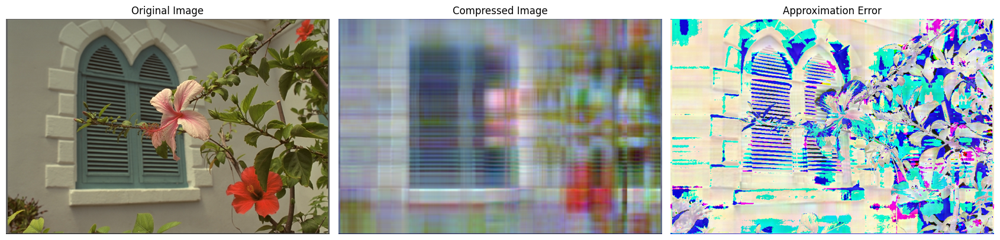
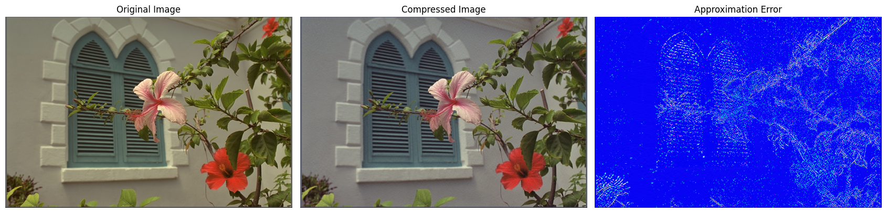
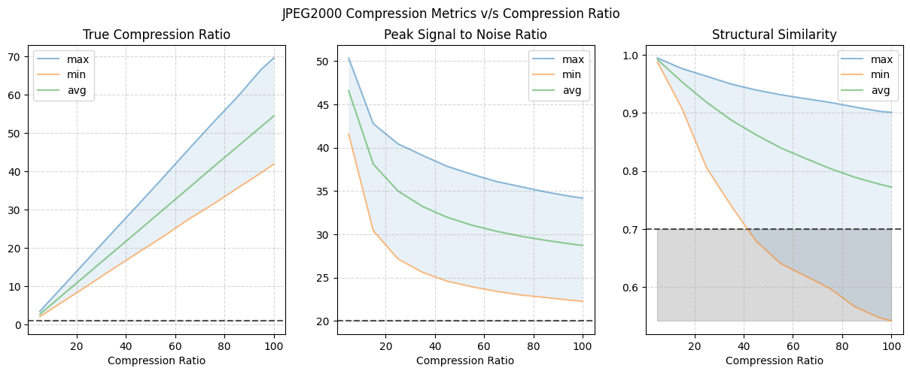
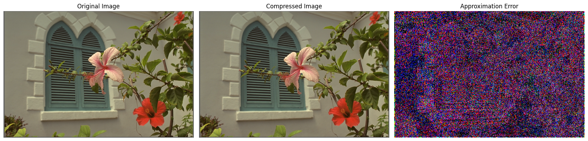
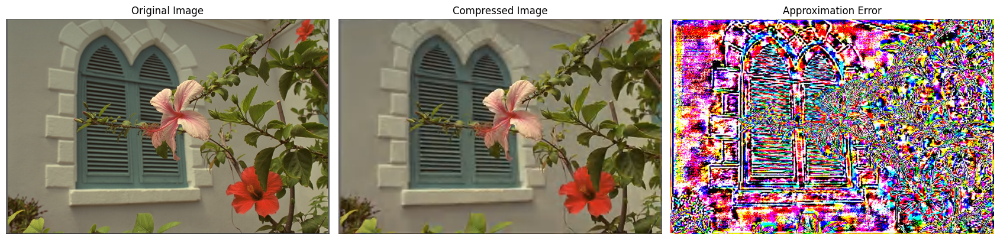

# dsc-210-project_image-compression

A systematic comparison of linear algebra-based and state of the art image compression techniques

**Course:** DSC 210 - Numerical Linear Algebra  
**Instructor:** Dr. Tsui-Wei Weng

The aim of this project is to compare SVD-based image compression with the state of the art method, JPEG2000. For this, we used the Kodak Lossless True Color Image Suite, which is a widely used benchmark in image compression research.

For SVD, we used `numpy`, and for JPEG2000, we utilized the implementation in `Glymur`. 


# Results

## SVD-based Image Compression
  
*For SVD, the parameter used to control the compression was the explained variance. A higher explained variance leads to lower compression ratios.*

SVD based compression achieved poor results, with compression ratios up to 2.2. Even at 97% variance, the PSNR, on average, was below 20 dB, and SSIM was under 0.7, indicating poor quality.

### SVD-based compression with a retained variance of 95%
  
*Here we have SVD-based compression at an explained variance of 95%. As evidenced by the difference of images, there was a significant loss of detail. This is why the compressed image does not look anything like the original image.*

### SVD-based compression with a retained variance of 99.9%
  
*If we increase the retained variance to 99%, the difference between images is minimal. We achieve a better quality image, but the compression ratio is close to 1.*

## JPEG2000
  
*The JPEG2000 compression was controlled by the compression ratio.*

JPEG2000 achieved compression ratios as high as 70, which is a 70 times reduction in file size, with high PSNR and structural similarity, indicating excellent compression quality.

### JPEG2000 compression with a compression ratio of 5
  
*Looking at the JPEG2000 compressed image at a compression ratio of 5, no discernable details were lost. This results in a better compression without loss of visual quality.*

### JPEG2000 compression with a compression ratio of 100
  
*Even at a compression ratio of 100, there was no blurring or loss of detail, demonstrating efficient compression without visual degradation.*


# Instructions for running the project:
## Option 1: Docker
1. Download the `Dockerfile`, or copy the following code into a `Dockerfile` (no need to clone the repository):
```
# Start with the Miniconda3 base image
FROM continuumio/miniconda3

# Set the working directory
WORKDIR /home

# Clone the repository
RUN git clone https://github.com/ar-bansal/dsc-210-project_image-compression.git

# Set the working directory to the cloned repo
WORKDIR /home/dsc-210-project_image-compression

# Update and upgrade system packages and install system dependencies
RUN apt-get update && apt-get upgrade -y && \
apt-get install -y libopenjp2-7 libopenjp2-tools libgl1-mesa-glx

# Create the conda environment from the environment.yaml file
RUN conda env create -f environment.yaml

# Create necessary directories for the project (relative paths)
RUN mkdir -p image_data/compressed_jp2 image_data/compressed_svd metrics/jp2 metrics/svd

# Set the environment variables in the .env file
RUN sed -i "s|^PROJECT_DIR=.*|PROJECT_DIR=$(pwd)|" .env

# Install jupyter in the environment
RUN conda run -n dsc210-project-team24 pip install jupyter

# Activate the environment and start Jupyter Notebook
CMD ["conda", "run", "-n", "dsc210-project-team24", "jupyter", "notebook", "--ip=0.0.0.0", "--allow-root", "--NotebookApp.token=''", "--NotebookApp.password=''"]
```

2. Build the docker image:
```
docker build -t image-compression-team24-notebook .
```
This step can take 2-4 minutes.

3. Run the image:
```
docker run -it --rm -p 8888:8888 image-compression-team24-notebook:latest
```
Ensure that no other container is already using port 8888, or use a different port. 
Jupyter may take some time to load, and you may need to refresh the browser a few times. 

4. Run the cells of the image_compression.ipynb notebook. 


## Option 2: Ubuntu/WSL + Conda
1. Clone the repository and navigate to the project's root directory.

2. Set up the environment:
    ```
    # Create the conda environment
    conda env create -f environment.yaml

    sudo apt-get update 
    sudo apt-get upgrade -y

    # Install `openJPEG` and other dependencies
    sudo apt install libopenjp2-7 libopenjp2-tools libgl1-mesa-glx

    # Activate the environment
    conda activate dsc210-project-team24

    # If using VS code, this can be skipped
    pip install jupyter
    ```

3. Set the paths in `.env`
    - `PROJECT_DIR` needs to be set to the current working directory (repo directory). DO NOT change the other variables.

4. Create the directories for storing the compressed images and the metrics
    ```
    mkdir -p image_data/compressed_jp2 image_data/compressed_svd metrics/jp2 metrics/svd
    ```

5. Run the cells of the image_compression.ipynb notebook. (If using VS Code, use the dsc210-project-team24 environment to create a kernel.)